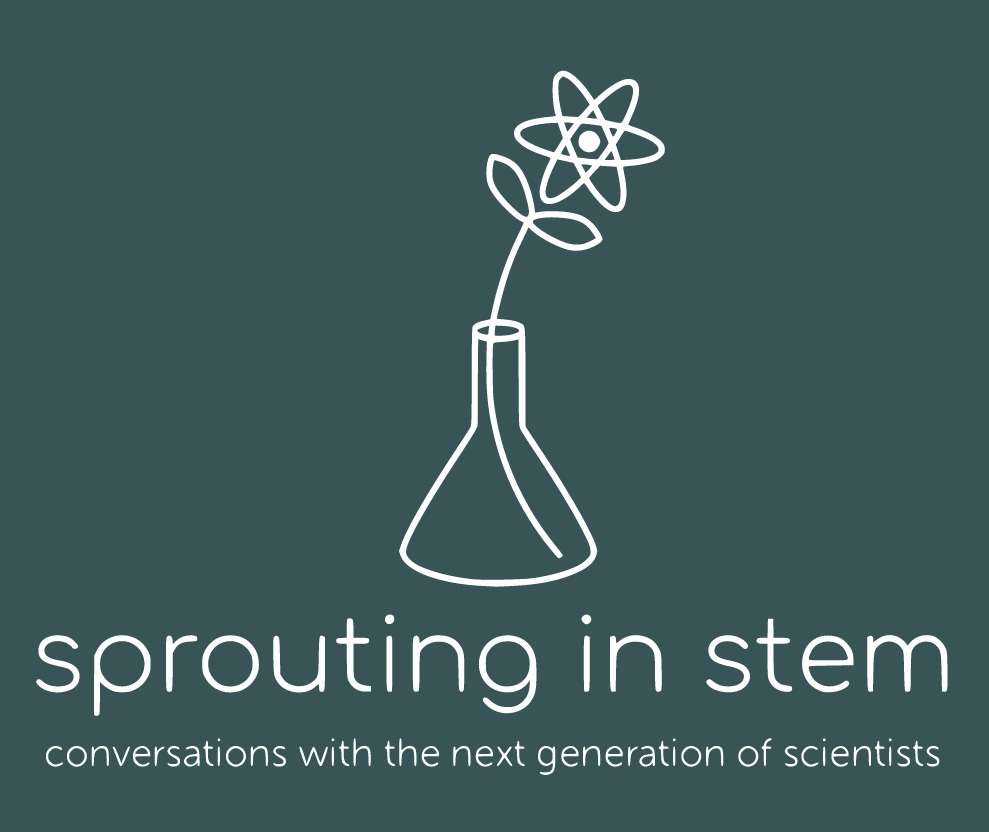

> The visions we offer our children shape the future. It matters what those visions are. Often they become self-fulfilling prophecies. Dreams are maps
> <cite> Carl Sagan

## Space Drafts
  
At the end of a long day, sometimes I just want to kick back, have a relaxing beverage, and listen to some cool science. Luckily you can do all that and more at Space Drafts! Space Drafts is Tucson's local version of Astronomy on Tap, which is a world-wide organization hosting astronomy-themed public talks at local bars and breweries. I am on the organizing committee for Space Drafts, and you can catch me at Borderlands Brewing in Tucson, AZ on the third Tuesday of every month. Also, check out our Twitter and Facebook pages (links coming soon)  
  
  
## Sprouting in STEM

Sometimes scientists get a bad rep. It's not all old dudes in dorky ties, and it's not always an easy time. I co-host a podcast named "Sprouting in STEM" where we discuss the trials and tribulations of being a young person starting a career in science. We hope to help make science more accessible to everyone, dorky tie or not. 

Check us out on [Spotify](https://open.spotify.com/show/1YxNuzlhAEdFiCtaFMODnb?si=nbenPv7BQ6CUq_cXV6Y_0g)

