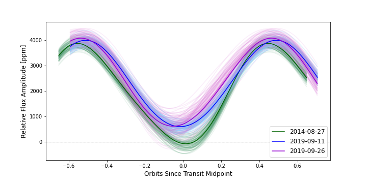
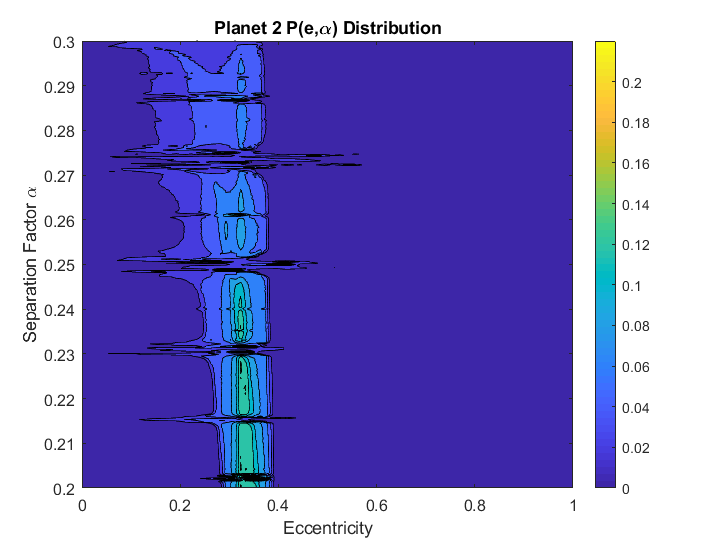

> Astronomy is useful because it raises us above ourselves; it is useful because it is grand; ... It shows us how small is man's body, how great his mind, since his intelligence can embrace the whole of this dazzling immensity, where his body is only an obscure point, and enjoy its silent harmony
> <cite> Henri Poincare

## Graduate Work

#### Limb Asymmetries and JWST/NIRCam
Exoplanets are generally expected to be cloudy. Particularly for tidally locked exoplanets, the formation and subsequent transport of clouds from one side of the planet to the other might lead to asymmetry in the size, structure, and composition of the planet's two transit limbs. I plan to search for these asymmetries using JWST. In particular, I am part of the JWST/NIRCam Transiting Exoplanet GTO team and will search for limb asymmetry in our GTO targets. 
  
#### Clouds and Atmospheric Variability on WASP-43b
Clouds are fun to gaze at from below, but become one's worst enemy when trying to observe at a telescope. Similarly, clouds on exoplanets are becoming notorious for blocking insights into exoplanet atmospheres. Furthermore, clouds might actually lead to changes in how we observe an exoplanet over time. If we only observe a planet once, and it changes over time, then we're missing out on key aspects about the nature of that planet. 
  
My first graduate project aimed to measure the degree of atmospheric variations as they affect a planet's phase curve. I analyzed three repeated phase curves of the hot Jupiter WASP-43b, observed by Spitzer/IRAC, and looked for any variations in the shape or amplitude of the phase curve between observations. Long story short ... there were none! Along with my amazing collaborators, we're using this observational upper limit on variability to place corresponding limits on how WASP-43b's clouds might be varying, in terms of their distribution or thickness. We hope to learn how hot Jupiter clouds vary in time, and predict their impact on future phase curve observations. Look for our paper coming out later this year!
  
This image here shows an example of the three phase curves of WASP-43b

## Undergraduate Work

#### Interacting Dynamical Resonances in Planetary Systems
Over the past twenty-five years, astronomers have discovered thousands of exoplanets. Many are found near orbital resonances, where the orbital periods of adjacent planets are in a near-integer ratio. Also, many planets are what we call "hot Jupiters", which are giant planets on super short-period orbits that get there due to secular processes. While resonant and secular processes both play a huge role in the evolution of a planetary system, the way they interact with one another is not fully understood. 

For my undergraduate thesis and a subsequent article in progress, I set out to explore the interplay between secular and resonant processes. I conducted a suite of N-body simulations using the [REBOUND](https://rebound.readthedocs.io/en/latest/) integrator package. We have published our results in MNRAS!

