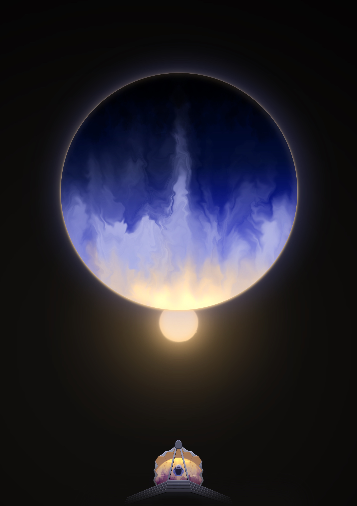
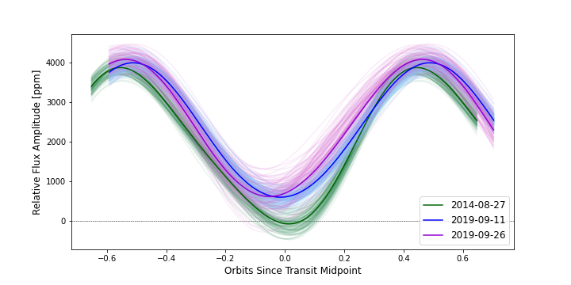

> Astronomy is useful because it raises us above ourselves; it is useful because it is grand; ... It shows us how small is man's body, how great his mind, since his intelligence can embrace the whole of this dazzling immensity, where his body is only an obscure point, and enjoy its silent harmony
> <cite> Henri Poincare

I am broadly interested in exoplanets, from atmospheric characterization to planetary habitability. My primary expertise is in the reduction and analysis of space- and ground-based observations of exoplanets. In space, I work with data from the James Webb Space Telescope, Hubble Space Telescope, and Spitzer Space Telescope. On Earth, I have worked with data from SOAR and the Kuiper telescope. 

## Graduate Work (current)

#### Evening and Morning Atmospheres
I am working in a new sub-field of exoplanet atmosphere characterization known as "limb-resolved transmission spectroscopy". Exoplanets cannot be spatially resolved, so we have to rely on indirect methods to infer their properties. For over a decade, [transmission spectroscopy](https://webbtelescope.org/contents/articles/spectroscopy-101--types-of-spectra-and-spectroscopy) has been one of the best tools that we have for revealing what makes up an exoplanet's atmosphere. This technique works by measuring the absorption of light, as a function of wavelength, due to the atoms, molecules, and clouds in the exoplanet's atmosphere, thus revealing their presence. Limb-resolved transmission spectroscopy takes this a step further by isolating the transmission spectrum of two distinct regions of the atmosphere -- the evening and morning terminators, which are the regions of the atmosphere we can probe in transit. Traditional techniques only measure their combination, but by separating them we can learn a lot more about the potential heterogeneity of the atmosphere and interesting dynamical and chemical processes. This new technique takes advantage of the power of the James Webb Space Telescope. 

I recently led one of the first applications of this new technique, published in the high-impact journal Nature Astronomy: [read it here on arXiv](https://arxiv.org/abs/2406.09863).

My work on this was also highlighted in news. Read the articles from [University of Arizona News](https://news.arizona.edu/news/astronomers-catch-glimpse-uniquely-inflated-and-asymmetric-exoplanet), [Arizona State Univ. News](https://news.asu.edu/20240924-science-and-technology-more-munch-popcorn-planet-unveils-new-atmospheric-details), [Science Daily](https://www.sciencedaily.com/releases/2024/09/240924123003.htm), and more online. 

This new technique will be extremely useful for understanding the dynamical processes that sculpt exoplanet atmospheres, and the physics and chemistry that underly cloud formation in exoplanet atmospheres. 

Check out this beautiful press image that Dr. Rachael Amaro created for us:

  
#### Clouds and Atmospheric Variability on WASP-43b
Clouds are fun to gaze at from below, but become one's worst enemy when trying to observe at a telescope. Similarly, clouds on exoplanets are becoming notorious for blocking insights into exoplanet atmospheres. Furthermore, clouds might actually lead to changes in how we observe an exoplanet over time. If we only observe a planet once, and it changes over time, then we're missing out on key aspects about the nature of that planet. 
  
My first graduate project aimed to measure the degree of atmospheric variations as they affect a planet's phase curve. I analyzed three repeated phase curves of the hot Jupiter WASP-43b, observed by Spitzer/IRAC, and looked for any variations in the shape or amplitude of the phase curve between observations. Long story short ... there were none! Along with my amazing collaborators, we're using this observational upper limit on variability to place corresponding limits on how WASP-43b's clouds might be varying, in terms of their distribution or thickness. We hope to learn how hot Jupiter clouds vary in time, and predict their impact on future phase curve observations. Look for our paper coming out later this year!
  
This image here shows an example of the three phase curves of WASP-43b

[Read our article here](https://ui.adsabs.harvard.edu/abs/2023AJ....165..107M/abstract)

## Undergraduate Work

#### Interacting Dynamical Resonances in Planetary Systems
Over the past twenty-five years, astronomers have discovered thousands of exoplanets. Many are found near orbital resonances, where the orbital periods of adjacent planets are in a near-integer ratio. Also, many planets are what we call "hot Jupiters", which are giant planets on super short-period orbits that get there due to secular processes. While resonant and secular processes both play a huge role in the evolution of a planetary system, the way they interact with one another is not fully understood. 

For my undergraduate thesis and a subsequent article in progress, I set out to explore the interplay between secular and resonant processes. I conducted a suite of N-body simulations using the [REBOUND](https://rebound.readthedocs.io/en/latest/) integrator package. We have published our results in MNRAS! [Read it here](https://ui.adsabs.harvard.edu/abs/2022MNRAS.512.2750M/abstract)

