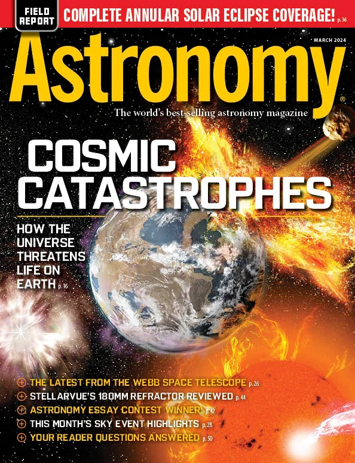
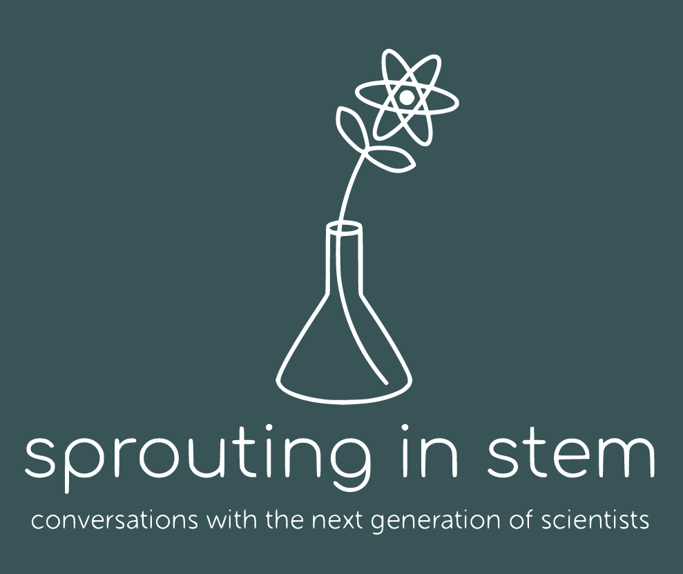

> The visions we offer our children shape the future. It matters what those visions are. Often they become self-fulfilling prophecies. Dreams are maps
> <cite> Carl Sagan

## Space Drafts
  
At the end of a long day, sometimes I just want to kick back, have a relaxing beverage, and listen to some cool science. Luckily you can do all that and more at Space Drafts! Space Drafts is Tucson's local version of [Astronomy on Tap](https://astronomyontap.org/), which is a world-wide organization hosting astronomy-themed public talks at local bars and breweries. I am on the organizing committee for Space Drafts, and you can catch me at Borderlands Brewing in Tucson, AZ on the third Tuesday of every month. 

You can watch live streams of our shows, as well as recordings of previous shows at our [YouTube channel](https://youtube.com/@spacedrafts1558?si=b4gcXexvN3lTwF9m). Feel free to reach out to me, or see our [Facebook page](https://www.facebook.com/SpaceDrafts/) for more information, especially if you are interested in joining. 

## Writing and Articles

I enjoy writing, and sharing science through the medium of writing. See some of my highlights here.
### Mysteries of the Moon
I contributed to an [article for Discover Magazine on the Moon](https://www.discovermagazine.com/the-sciences/scientists-are-still-pondering-these-mysteries-of-the-moon) with journalist Sara Novak, talking about why the Moon is so interesting both scientifically and personally. 

### Astronomy Magazine
There are endless stars up in the night sky, with a dazzling array of colors. But ... have you ever wondered why none of them are green? Find out the answer to this question and more in my "Ask Astro" column in the [March 2024 edition of Astronomy Magazine](https://www.astronomy.com/issues/2024/march-2024/).

  
## Sprouting in STEM

Sometimes scientists get a bad rep. It's not all old dudes in dorky ties, and it's not always an easy time. During my undergraduate years, I co-hosted a podcast named "Sprouting in STEM" where myself and my friend and colleague discussed the trials and tribulations of being a young person starting a career in science. We focused on our experiences as Physics students, but also interviewed our colleagues in other fields including biology. We hoped to help make science more accessible to everyone, dorky tie or not. 

We are not currently recording new content, but you can find our previous episodes on [Spotify](https://open.spotify.com/show/1YxNuzlhAEdFiCtaFMODnb?si=nbenPv7BQ6CUq_cXV6Y_0g)

