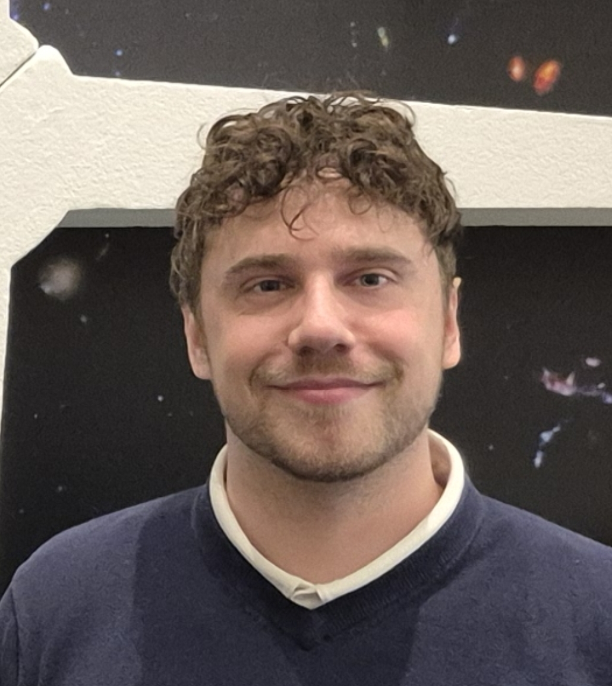

# About Me

Hello! I'm Matthew, a Postdoctoral Research Associate at Michigan State University.

If you want to **contact me**, feel free to email me at mmmurphy@msu.edu

I study exoplanets and their atmospheres through a variety of observational techniques. I'm interested in the composition and dynamics of exoplanet atmospheres, and building maps of the global properties of the atmosphere using the James Webb Space Telescope. I am also interested in habitability, both inside and outside the Solar System, and work on exo-habitability as a member of the NASA Nexus for Exoplanet System Science. In addition to my research, I enjoy popular science and scientific outreach through both speaking and writing in the media. I believe in supporting and inspiring young scientists.

To learn more about me and my work. Head to the **link at the top right where it says "POSTS"**.
